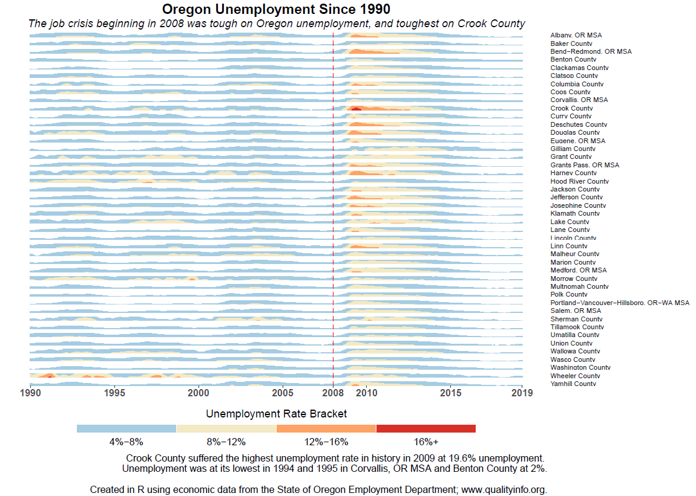

# Horizon Plot of Oregon County and MSA Unemployment since 1990

A reproducible example of an exploration of Oregon county and MSA unemployment data. R code tidies and explores statistical summaries and visualizations of appropriately downloaded file. The code produces a well-polished horizon plot inspired by those created by Jorge Camoes in Excel.

## Getting Started

This section provides a brief overview of the software required to properly run the applet included in this project.

### Prerequisites

1. Required Software
  + R (RStudio recommended)

The R Statistical Software page can be found [here](https://www.r-project.org).

## Authors

* Sean Pitman - Oregon State University
  
## Acknowledgements

* Dr. Charlotte Wickham 
* The ST 537 Class
